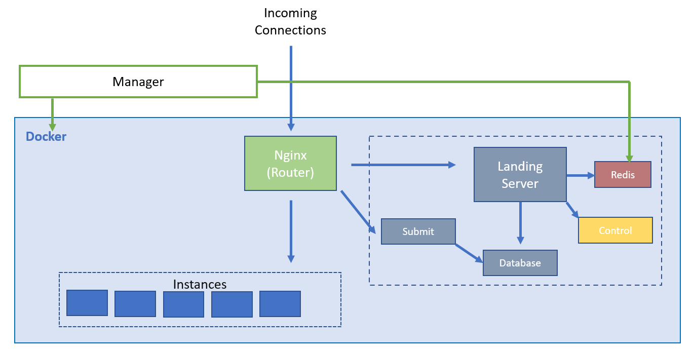
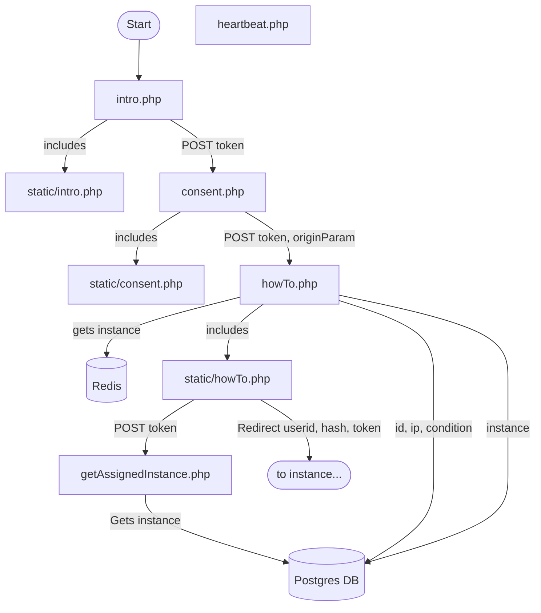

# Developer Observatory Technical Notes
The **Developer Observatory** is a browser-based platform for conducting controlled programming experiments. This page is primarily dedicated to describing the technical aspects of the software.

For a typical study, a participant will first see introductory information and a consent form. When the user completes the consent form, the platform will create an isolated docker container for the participant with all developer tools preinstalled. The user will then be proxied into the interface's Jupyter interface and complete the study in the instance. After the user is finished, the instance is destroyed.

The application is docker-based, with multiple containers hosting the study backend, and a variable amount of containers hosting the study instances.

Below is an architectural overview

## Manager
The Docker manager is a python script that interfaces with the host's docker daemon to create and destroy study instances as needed. Currently the manager:
- Keeps the pool of standby instances full
- Removes old instances as signaled by the `control` container

## Containers
Within the docker environment there are the infrastructure containers, the study instances, and the Nginx container that proxies requests to each.

Infrastructure containers:
- Redis
- Landing
- Submit
- Control
- Database

Technical details of each is below.
### Redis
Container name: `redis`
Base image: `redis:alpine`
Ports: `6379`

Redis is used as the communication link between the infrastructure containers and the manager that sits on the host.

Keys:
- `queuedInstances`: List of instance names on standby. Uses `|||` as a seperator between name and instance id. ID is used for DNS resolution, name is practically discarded
- `queuedInstancesBooting`: Counter to track how many instances are currently booting so we don't start too many.
- `oldInstances`: Instances to be terminated by manager since they are no longer active. Instances are added by `control`.

Common commands:
`GET queuedInstancesBooting`: returns current counter
`LRANGE queuedInstances 0 -1`: returns entire list

### Control
Container name: `control`
Base image: `tiangolo/uwsgi-nginx-flask:python3.8`

Currently only checks for old instances. Will eventually host a status and control page for the system.

To start test server:
`docker run -it --rm --net devob_main --name control_test --mount type=bind,source=$PWD/containers/control/,target=/usr/src/app devob_control /bin/bash`

### Database
Container name: `db`
Base image: `postgres`

Command to access db: `psql notebook created_instances_user`

#### Schema
createdInstances:

| Column name | Description |
| ----------- | ----------- |
|id | primary key |
|userid | used to identify users. Part of URL as `token` |
|ip | IP address instance created from |
|ec2instance| Name of the instance. This is the human readable name that docker assigns to a container like `hardcore_cannon`. This is not used |
|category| Category assigned to this instance |
|condition| Condition assigned to this instance |
|instanceid| ID of the instance. In docker this is a 12 character alphanumeric. Used to construct redirect URL|
|finished| Has the user finished the study? |
|heartbeat| Timestamp for when the last heartbeat event was received |
|instanceTerminated| Has the instance been terminated by the instance killer? |

### Landing Server
Container name: `landing-server`
Base image: `php:7-fpm`

#### `intro.php`
- Checks token by contacting token URL
- Rejects mobile browser using snippet from http://detectmobilebrowsers.com/
- Checks study count

#### `consent.php`
- Presents consent form with recaptcha
- Checks study count

#### `howTo.php`
- Checks consent form responses
- Checks token
- Checks reCaptcha
- Checks study count
- Checks daily per-ip max instance count
- Assigns condition and category
	- Uses this beast: `SELECT category, categorycount FROM (SELECT c.category as category, COUNT(ci.category) as categorycount FROM conditions c LEFT JOIN "created    Instances" ci ON c.condition = ci.condition GROUP BY c.category ORDER BY c.category) AS c ORDER BY categorycount ASC LIMIT 1;`
- Adds user to database if not already there
- Gets instance from redis queue, adds to database
- Invalidates token

#### `static/howTo.php`
- POSTs to `getAssignedInstance.php`

#### `getAssignedInstance.php`
- Queries database for instance assigned by `howTo.php`
- Returns redirect URL

#### `heartbeat.php`
- Separate from everything else

Diagram of flow:

### Submit
Container name: `submit`
Base image: `tiangolo/uwsgi-nginx-flask:python3.8`
Runs on port `6200`

Has the following endpoints:

`/getcode/<string:userid>/<string:token>`
Returns all code from database run through an html code highlighter
Does some weird stuff with JSONP again

`/getipynb/<string:userid>/<string:token>`
Used for serving ipynb files to new study instances
Returns entire ipynb file from filesystem
Not called directly from browser JS

`/survey/<string:userid>/<string:token>`
Returns redirect url to survey, with userid and token attached as parameters
Not called directly from browser JS
Terminates instances (currently disabled)

`/submit`
Used to submit code snippets or pasted code
Uses hard-coded auth-token of ``q9c(,}=C{mQD~)2#&t3!`fLQ3zk`9,``
Code submissions have max length of `1000000`
Not called directly from browser JS, goes through Flask proxy on instance

### Nginx
### Instance
Study instance containers.
Running processes:
- Flask App
	- Handles retrieving task file from internal endpoint (`/get_ipynb`)
	- Submits notebook code
	- Redirects user to survey
- Jupyter Notebook
	- Runs customized jupyter notebook to serve study tasks and record data

Study instance resource limits
- Total Memory (mem+swap): `128m`
	- At idle study instances use 63MiB
- CPU Shares: 512 (half of normal)
	- Priority is given to study infrastructure instances
